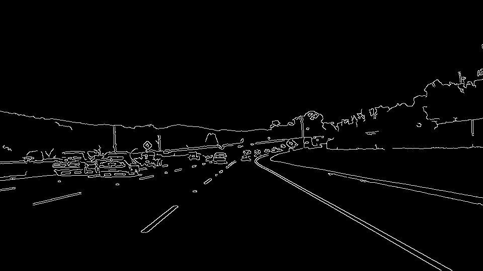
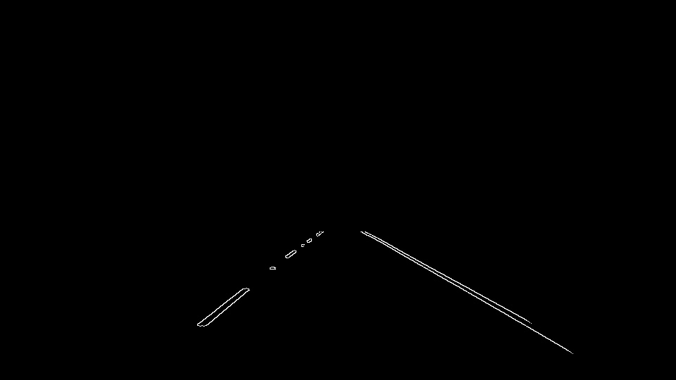
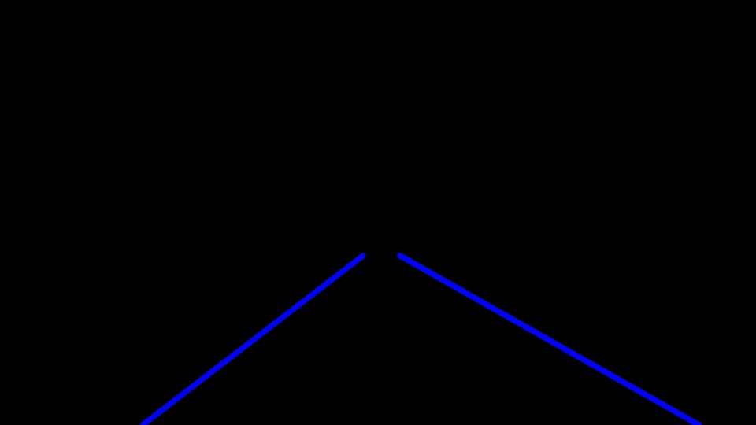
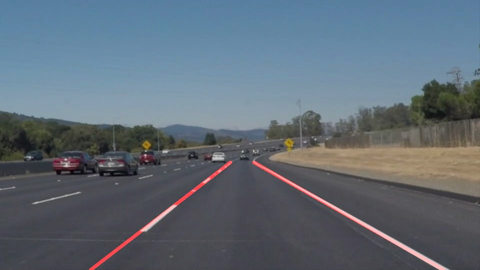

# **Finding Lane Lines on the Road** 

## Writeup

---

**Finding Lane Lines on the Road**

The goals / steps of this project are the following:
* Make a pipeline that finds lane lines on the road
* Reflect on your work in a written report

---

### Reflection

### 1. Pipeline description, and how I modified the draw_lines() function.

My pipeline consisted of 5 steps. First, I converted the images to grayscale, then I removed the noise using the Gaussian filter which may create a sudden change that may be considered a line by Canny algorithm. Third, I applied the canny transform to detect the edges and because I am interested in a certain area which I predict that the road lane is located there so I extracted the lines on only this region of interest. Forth, I applied the Hough transform on the lines with different parameters until I got the best identification for the lines that located on the left/right lane line then I draw them on the original image.

.... 

In order to draw a single line on the left and right lanes, I modified the draw_lines() function by dividing the lines into two groups left lines and right lines using the slope sign if the slop is positive this mean it belongs to the left lane line otherwise this line belongs to the right lane line also I calculate the intercept for each line to represent each line with its slope and intercept and the number of pixels that used to draw this line as a weight.

After that, I used the weight of each line to make it more or less effective in the averaging. Then I drew these lines on the original image

...

### 2. Potential shortcomings with my current pipeline

One potential shortcoming would be that my pipeline doesn't support the lightening difference in the image so If the lane got darker because of the shadow it will be difficult to identify the lane. 

Also, If the lane got very curvy I think my pipeline will fail with lane identification we can see the end of lanes in the images are curvy and the pipeline couldn't catch them accurately.

### 3. Possible improvements to my pipeline

First, use the general form of Hough transform to identify different shapes which will help to identify on the straight or curvy lines.

Second, we can use the colour as a parameter to support my pipeline to identify the lane lines in different light situations so shadows will not effect the algorithm identification accuracy.